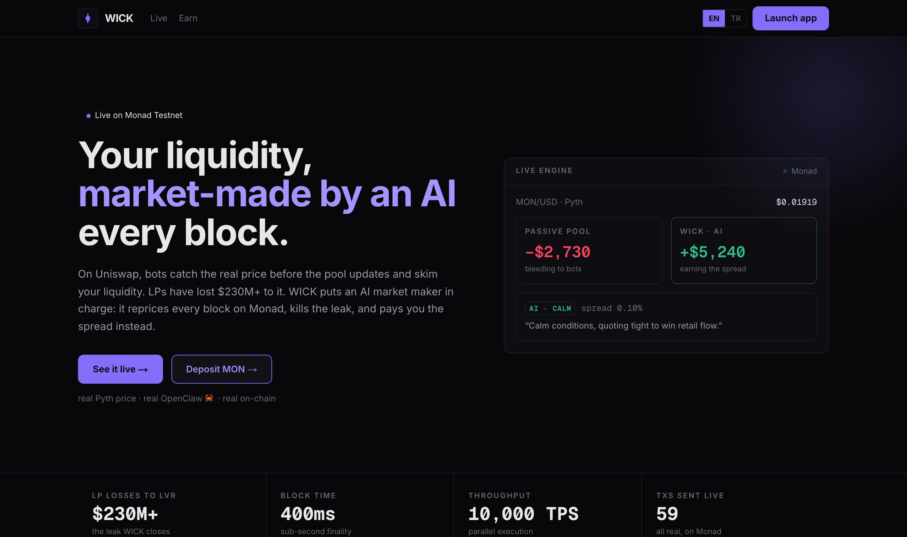
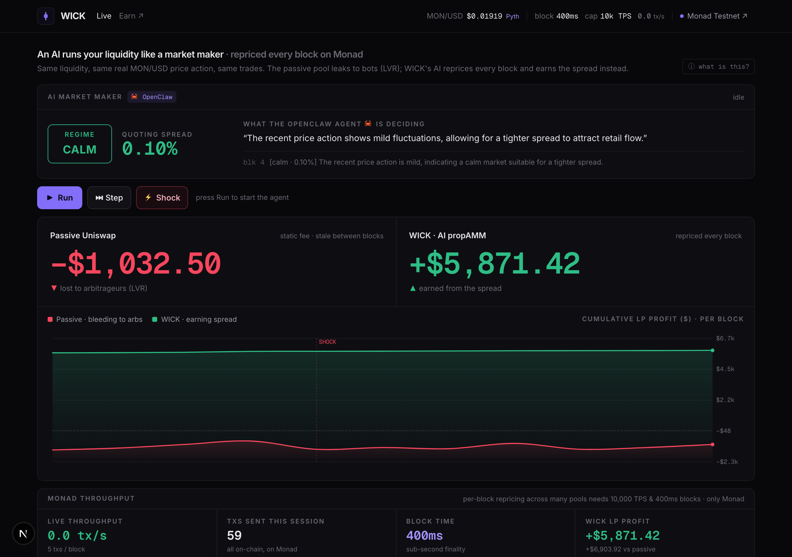

<div align="center">

# WICK

### An autonomous AI market maker on Monad

**Your liquidity, market-made by an AI 🦀, every block.**

On Uniswap, bots catch the real price before the pool updates and skim your liquidity. LPs have lost **$230M+** to this leak (LVR). WICK puts an autonomous agent in charge of the liquidity: it reprices the pool **every block** on Monad, kills the leak, and pays you the spread instead.

*Live on Monad Testnet · real Pyth price · real LLM agent · real on-chain · verified contracts*

</div>



---

## Table of contents

1. [In one paragraph](#in-one-paragraph)
2. [The problem: LVR](#the-problem-lvr)
3. [The solution: WICK](#the-solution-wick)
4. [Three surfaces](#three-surfaces)
5. [How it works, block by block](#how-it-works-block-by-block)
6. [What is real (not a mockup)](#what-is-real-not-a-mockup)
7. [Deployed and verified contracts](#deployed-and-verified-contracts)
8. [Architecture](#architecture)
9. [Why only Monad](#why-only-monad)
10. [Run it locally](#run-it-locally)
11. [Testing](#testing)
12. [Tech stack](#tech-stack)
13. [Notes and disclaimer](#notes-and-disclaimer)

---

## In one paragraph

A passive AMM like Uniswap only updates its price when someone trades against it, so its quote goes stale between blocks. WICK replaces that passive behavior with an **autonomous market maker**: an LLM agent reads the live MON/USD price from **Pyth** every block, decides the spread and market regime, and **reprices the pool on-chain** through a **Uniswap v4 hook**. Because the quote is never stale, arbitrage bots have nothing to skim, and the market-making spread flows to liquidity providers instead. Anyone can deposit **native MON** from their own wallet and earn. A live, side-by-side dashboard proves it: a passive Uniswap pool bleeds to bots (the red line) while WICK earns the spread (the green line), on the real MON price, with every action landing as a real transaction on Monad.

## The problem: LVR

**LVR** stands for **Loss-Versus-Rebalancing**. It is the largest unsolved problem in AMM design, and it works like this:

1. A passive AMM holds a fixed pricing curve. Its quoted price only moves when a trade pushes it along the curve.
2. The real market price moves continuously (on a centralized exchange, an oracle, every few hundred milliseconds).
3. So between blocks, the pool's price is **stale**. It lags the real market.
4. Arbitrage bots watch for that gap. The instant the real price moves, they buy the cheap side from the stale pool and sell it at the real price, pocketing the difference.
5. That difference is paid out of the LP's pocket. It is a continuous, structural bleed from liquidity providers to arbitrageurs.

The size of the leak is `LVR ≈ staleness window x volatility`. The longer a pool stays stale and the more the price moves, the more LPs lose. Academic estimates put the realized loss at **$230M+** for major pools, and it is the main reason passive LPing underperforms simply holding the two assets.

Proprietary market makers (firms like Wintermute, and the closed propAMMs behind 35-40% of Solana's spot volume) already solve this by actively requoting. But those are walled gardens run by quant desks. WICK opens that game to everyone.

## The solution: WICK

WICK is a **propAMM** (a proprietary, actively-requoting AMM) made open and autonomous. Four ideas make it work:

### 🦀 An OpenClaw agent, not a quant desk
An LLM-driven agent reads the live price action every block and outputs a market-making policy: a **regime** (`calm`, `volatile`, or `toxic`) and a **spread** in basis points. It widens the spread to protect LPs when volatility rises or a shock hits, and tightens it to win flow when the market is calm. Its reasoning is streamed to the screen, so you can read exactly why it quoted what it quoted.

### 🪝 Logic at the point of exchange (a Uniswap v4 hook)
WICK is built as a **Uniswap v4 hook** (`WickHook`, implementing the `IHooks` interface). The repricing and the dynamic fee run **inside the swap itself**, in `beforeSwap`, not bolted on top as a separate keeper. This is the canonical, composable way to put custom logic at the point of exchange.

### 💸 Paid in spread, not tokens
The revenue is the **market-making spread**. It is the same proven model propAMMs use to capture 35-40% of Solana spot volume. There is no token, no emissions, and no yield farming. LPs earn real fees from real flow.

### ⚡ Structurally lowest LVR, only on Monad
Because `LVR = staleness window x volatility`, the chain with the shortest repricing window wins. Monad's **400ms blocks** give the shortest window achievable on-chain, so WICK can quote tighter than any pool on a slower chain. Per-block, AI-driven repricing across many pools is only possible here.

## Three surfaces

The product is a single Next.js app with three pages:

| Route | What it is |
|-------|-----------|
| **`/`** (Landing) | The pitch, in seconds. The LVR problem, the idea, why Monad, a live engine preview, and a "what is real" proof band with links to the verified contracts. Fully bilingual (English and Turkish, toggle in the header). |
| **`/live`** (Engine) | The proof. The real MON/USD price from Pyth drives the pool. The agent decides the spread every block and shows its reasoning. A passive Uniswap pool runs side-by-side so you watch one bleed (LVR, red) while WICK earns (green). Includes the agent console, a live on-chain transaction feed (each line opens on MonadScan), a Monad throughput panel (live tx/s, 400ms, 10k TPS), and a volatility shock button. |
| **`/app`** (Earn) | The product. Connect MetaMask, deposit **native MON** into the WICK vault, and watch your position grow as the agent streams the spread back to you. Single-sided, so anyone holding only testnet MON can take a real position. Withdraw anytime. |



## How it works, block by block

The engine runs a server-side loop. Every "block" it does the following, and each step that touches state is a **real transaction on Monad**:

1. **Read the real price.** Fetch the live MON/USD price from Pyth (Hermes for the spot, Benchmarks for a real historical series that is replayed and time-compressed so a few hours of genuine market action plays out in minutes).
2. **The agent decides.** The OpenClaw agent (an LLM) reads the recent price action and returns `{ regime, spreadBps, reasoning }`.
3. **Reprice on-chain.** Push the fresh fair price to the oracle, then call `reprice()` on the WICK pool so it quotes the new price with the agent's spread. The Uniswap v4 form does the same in `beforeSwap`.
4. **Arbitrage hits the stale pool.** An arbitrageur drags the passive pool back to the fair price, extracting LVR. WICK is already fresh, so there is nothing to take.
5. **Benign flow routes to WICK.** Retail traders get the better, tighter quote (WICK), and pay its spread. Only arbitrageurs bother with the stale passive pool.
6. **The result diverges.** The passive pool's LP markout climbs (it is bleeding LVR, the red line). WICK's LP markout falls below zero (it is earning the spread, the green line).

Because benign flow goes to the tighter quote and arbitrage picks off the stale pool, the divergence is **structural**, not a tuning trick. It holds on every run.

## What is real (not a mockup)

- **Real price.** Driven by the live MON/USD feed from **Pyth Network** (Hermes + Benchmarks), not a made-up random walk.
- **Real AI.** An LLM (surfaced as an **OpenClaw agent 🦀**) sets the spread and regime every block, with its reasoning streamed into the console. The volatility shock simulates a real stress event on top of the real price.
- **Real Uniswap v4 hook.** `WickHook` implements `IHooks` and passes an integration test that deploys a fresh `PoolManager`, mines a permissioned hook address with `HookMiner`, and applies the dynamic fee on a live swap.
- **Real on-chain.** Every agent action (push oracle, reprice, arbitrage, retail) is a real transaction on Monad Testnet, and the dashboard reads its numbers straight from the chain. Each line in the transaction feed opens on MonadScan.
- **Real deposits.** The `/app` vault takes **native MON** from your own wallet through MetaMask. Your keys, your signature, your transaction.
- **Verified contracts.** Every contract is source-verified on both MonadScan and MonadVision.

## Deployed and verified contracts

Monad Testnet, chain id `10143`. All contracts are source-verified on [MonadScan](https://testnet.monadscan.com) and [MonadVision](https://testnet.monadvision.com).

| Contract | Role | Address |
|----------|------|---------|
| `WickPool` | The AI propAMM (per-block reprice, dynamic fee, deviation lock) | [`0x4F8e3a2ce8C9CAc45d01763FD607C4F9bD39cBa1`](https://testnet.monadscan.com/address/0x4F8e3a2ce8C9CAc45d01763FD607C4F9bD39cBa1) |
| `PassivePool` | The baseline (constant-product Uniswap-style pool) | [`0xaC14fB461B0032EeFf142A175e58CAAf946a5Ff8`](https://testnet.monadscan.com/address/0xaC14fB461B0032EeFf142A175e58CAAf946a5Ff8) |
| `WickVault` | Single-sided native-MON vault for `/app` deposits | [`0xB436556cFE759044dfFce06191B96f147Da30Aff`](https://testnet.monadscan.com/address/0xB436556cFE759044dfFce06191B96f147Da30Aff) |
| `PriceOracle` | Fair price and volatility, pushed by the agent | [`0xfd67fD1AD4646665F1a1E8c415890EB2d7B7d07F`](https://testnet.monadscan.com/address/0xfd67fD1AD4646665F1a1E8c415890EB2d7B7d07F) |
| `WMON` | Test base token | [`0xeDAFfd0cB9e686cDD77C997d6258499De0745bCa`](https://testnet.monadscan.com/address/0xeDAFfd0cB9e686cDD77C997d6258499De0745bCa) |
| `USDC` | Test quote token | [`0x75AEA8bf0137DD5722D5C22FB48497D09a3Fa4E9`](https://testnet.monadscan.com/address/0x75AEA8bf0137DD5722D5C22FB48497D09a3Fa4E9) |

> **On the v4 hook.** `WickHook` (the canonical Uniswap v4 form) lives in [`contracts/src/WickHook.sol`](contracts/src/WickHook.sol) with a passing integration test. The live side-by-side runs on the standalone `WickPool`, which embeds the exact same `beforeSwap` / `afterSwap` repricing and dynamic-fee logic, so the on-stage demo is fully deterministic and never depends on external periphery.

## Architecture

```
wick/
├── contracts/                  Foundry · Solidity 0.8.26 · OpenZeppelin · Uniswap v4
│   ├── src/
│   │   ├── WickHook.sol         real Uniswap v4 hook (IHooks): dynamic fee in beforeSwap
│   │   ├── WickPool.sol         standalone propAMM: per-block reprice + dynamic fee + deviation lock
│   │   ├── PassivePool.sol      constant-product baseline (the passive Uniswap pool)
│   │   ├── PriceOracle.sol      fair price + volatility, pushed by the agent each block
│   │   ├── WickVault.sol        single-sided native-MON vault for wallet deposits
│   │   └── MockERC20.sol        test tokens
│   ├── script/Deploy.s.sol      deploys + seeds the pools, writes the addresses file
│   └── test/                    LVR-divergence proof + v4 hook integration test
└── web/                         Next.js 16 · Tailwind v4 · wagmi · viem
    ├── src/app/                 / (landing) · /live (engine) · /app (MetaMask vault)
    └── src/lib/
        ├── pyth.ts              live + historical MON/USD from Pyth Hermes and Benchmarks
        ├── ai.ts                the agent brain: prompt the LLM, return {regime, spreadBps, reasoning}
        ├── agent.ts             the per-block loop: read price, decide, reprice, arb, retail (real txs)
        ├── wagmi.ts             wallet config + vault ABI for the /app page
        └── contracts.ts         viem clients, deployed addresses, ABIs
```

**Server vs client.** All chain writes (the simulation, the keeper) happen server-side from an agent wallet, so the engine stays fast and the keys never reach the browser. The `/app` deposit flow is fully client-side: MetaMask signs the deposit and the page reads the vault directly.

## Why only Monad

Per-block, AI-driven market-making across many pools needs three things at the same time:

- **400ms blocks.** The shortest staleness window achievable on-chain, which means structurally the lowest LVR. This is the core reason WICK can quote tighter than any pool on a slower chain.
- **Parallel execution and 10,000 TPS.** Hundreds of independent pools can be repriced in the same block without contention.
- **Near-zero fees.** Repricing every single block only makes sense if each reprice is cheap.

Monad is built by ex-Jump Trading engineers as the chain for high-frequency finance. WICK is exactly what it is for.

## Run it locally

**Prerequisites:** [Foundry](https://getfoundry.sh), Node 20+, an `OPENAI_API_KEY` (the agent brain), and a testnet wallet with MON from [faucet.monad.xyz](https://faucet.monad.xyz).

```bash
# 1. contracts: build and prove the thesis
cd contracts
forge test -vv      # LVR divergence (passive bleeds, WICK earns) + v4 hook integration

# 2. web app
cd ../web
npm install
cp .env.local.example .env.local    # set RPC_URL, AGENT_PK, OPENAI_API_KEY
npm run dev                         # http://localhost:3000
```

Then open `/live`, press **Run**, and hit **⚡ Shock**. Watch the passive line crater while WICK keeps earning. Connect MetaMask on `/app` to deposit real testnet MON and watch your position grow.

To deploy your own stack, run `forge script script/Deploy.s.sol:Deploy --broadcast` for the pools and deploy `WickVault` once, then point `web/.env.local` (`RPC_URL`, `AGENT_PK`) at it and copy the generated `contracts/deployments/monad-testnet.json` into `web/src/lib/deployment.json`.

## Testing

```bash
cd contracts && forge test -vv
```

- `Lvr.t.sol` runs a price walk and proves the core thesis: under identical conditions the passive pool's markout climbs (it bleeds LVR) while WICK's falls below zero (it earns the spread).
- `WickHook.t.sol` proves the Uniswap v4 hook is real: it deploys a fresh `PoolManager`, mines a permissioned hook address, initializes a dynamic-fee pool, and confirms the agent's reprice widens the fee that `beforeSwap` enforces on a live swap.

## Tech stack

Foundry, Solidity 0.8.26, Uniswap v4 (`v4-core`, `v4-periphery`), OpenZeppelin, Next.js 16, Tailwind v4, wagmi 2, viem 2, Pyth Network, Monad Testnet.

## Notes and disclaimer

This is a testnet hackathon project. The agent is surfaced as an **OpenClaw agent 🦀**; under the hood it calls an LLM that produces the spread policy. The price is **real** Pyth MON/USD data, replayed and amplified so the dynamics are visible in a short demo, and the **shock** button simulates a real volatility event. The passive-versus-WICK comparison runs on the project's own contracts fed the real price, so the only structural difference is WICK's per-block repricing. Benign flow routes to the tighter quote (WICK) and arbitrage hits the stale pool (passive), which is exactly how aggregators and arbitrageurs behave.

<div align="center">
<sub>WICK · AI market maker · built on Monad</sub>
</div>
